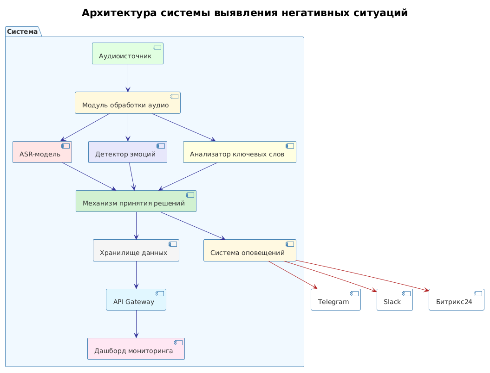
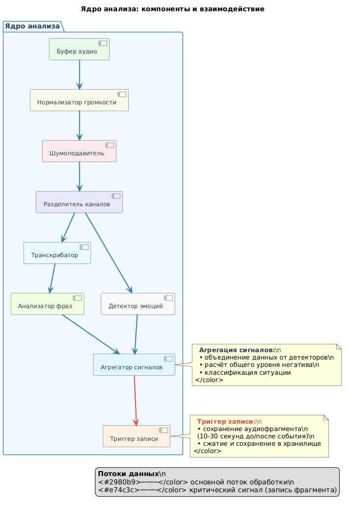
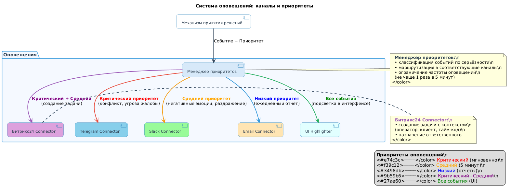
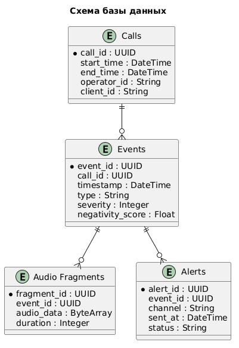
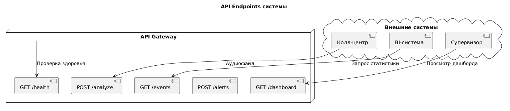
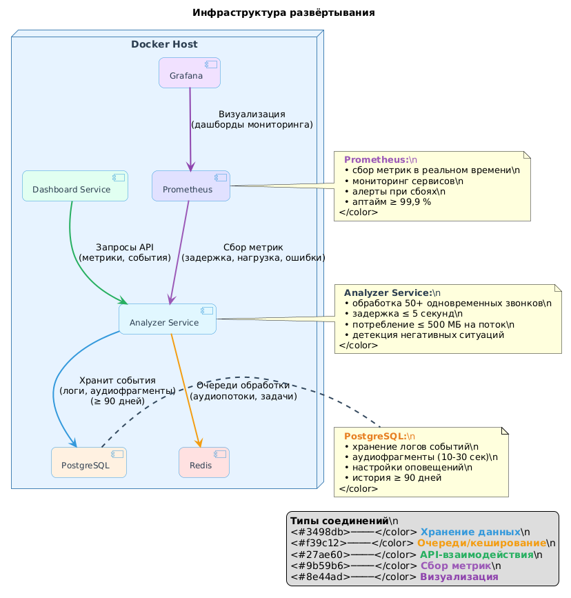
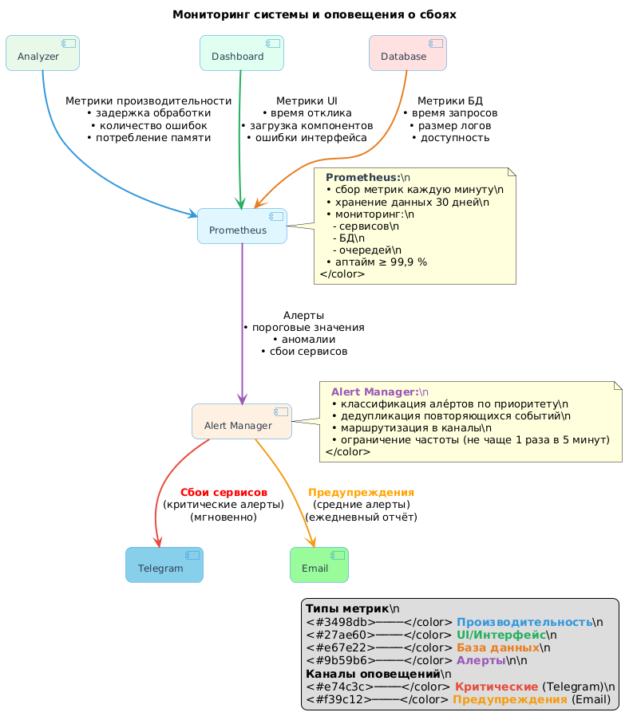
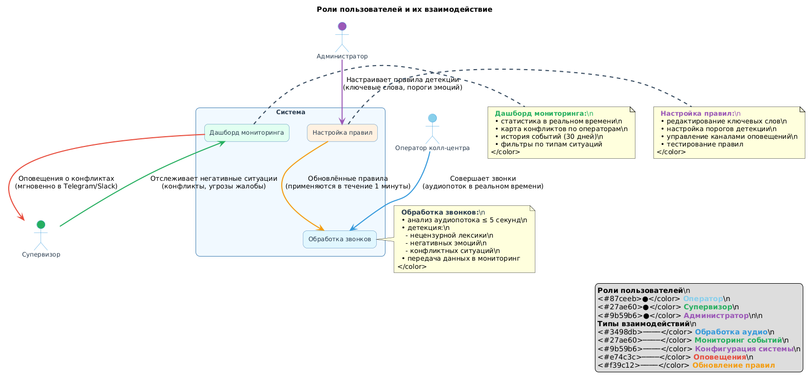

# Система выявления негативных ситуаций

**Цель:** создать сервис реального времени для анализа разговоров и оповещения супервизоров о негативных ситуациях (конфликт, угроза жалобы, нецензурная лексика) с использованием моделей детекции эмоций и ключевых слов на русском языке.

## Содержание

* [Требования к системе](#требования-к-системе)
* [Этап 1. Анализ и проектирование](#этап‑1-анализ-и-проектирование)
* [Этап 2. Подготовка окружения](#этап‑2-подготовка-окружения)
* [Этап 3. Разработка ядра анализа](#этап‑3-разработка-ядра-анализа)
* [Этап 4. Интеграция с каналами оповещения](#этап‑4-интеграция-с-каналами-оповещения)
* [Этап 5. Разработка дашборда](#этап‑5-разработка-дашборда)
* [Этап 6. Тестирование](#этап‑6-тестирование)
* [Этап 7. Развёртывание и мониторинг](#этап‑7-развёртывание-и-мониторинг)
* [Этап 8. Обучение пользователей](#этап‑8-обучение-пользователей)
* [Этап 9. Пилотное внедрение](#этап‑9-пилотное-внедрение)
* [Диаграммы. ](#диаграммы)

## Требования к системе

Подробнее о требованиях к системе читайте в файле [requirements.md](requirements.md).

## Этапы реализации

### Этап 1. Анализ и проектирование

Описание этапа: сбор требований, проектирование архитектуры, выбор моделей.

Подробности по этапу — в файле [stage_1.md](stage_1.md).

### Этап 2. Подготовка окружения

Описание этапа: настройка инфраструктуры, установка зависимостей, база данных.

Подробности по этапу — в файле [stage_2.md](stage_2.md).

### Этап 3. Разработка ядра анализа

Описание этапа: реализация модулей обработки аудио, распознавания речи, детекции эмоций.

Подробности по этапу — в файле [stage_3.md](stage_3.md).

### Этап 4. Интеграция с каналами оповещения

Описание этапа: подключение Telegram, Slack, email, Битрикс24 для доставки уведомлений.

Подробности по этапу — в файле [stage_4.md](stage_4.md).

### Этап 5. Разработка дашборда

Описание этапа: создание интерфейса для мониторинга ситуаций и статистики.

Подробности по этапу — в файле [stage_5.md](stage_5.md).

### Этап 6. Тестирование

Описание этапа: модульное, интеграционное и нагрузочное тестирование системы.

Подробности по этапу — в файле [stage_6.md](stage_6.md).

### Этап 7. Развёртывание и мониторинг

Описание этапа: деплой в продакшн, настройка логирования и алертинга.

Подробности по этапу — в файле [stage_7.md](stage_7.md).

### Этап 8. Обучение пользователей

Описание этапа: подготовка инструкций, проведение тренингов для супервизоров и операторов.

Подробности по этапу — в файле [stage_8.md](stage_8.md).

### Этап 9. Пилотное внедрение

Описание этапа: запуск в ограниченном режиме, сбор обратной связи, корректировка.

Подробности по этапу — в файле [stage_9.md](stage_9.md).

## Диаграммы системы

Все диаграммы архитектуры и процессов системы созданы с использованием PlantUML и визуализированы в формате PNG.

### Перечень диаграмм

Полный список диаграмм с описанием и исходным кодом PlantUML доступен в файле [diagrams.md](diagrams.md).

### Визуализация ключевых диаграмм

### Визуализация диаграмм

Ниже представлены изображения всех диаграмм системы (из каталога `diagrams/`):

#### 1. Общая архитектура системы

*Показывает общую структуру системы, взаимодействие основных компонентов и потоков данных: колл‑центр, ядро анализа, система оповещений, мониторинг, БД.*

#### 2. Поток данных при обработке звонка

*Описывает последовательность обработки аудиопотока: от получения RAW‑аудио до детекции негативных ситуаций и сохранения результатов. Включает этапы нормализации громкости и шумоподавления.*

#### 3. Компоненты ядра анализа

*Детализирует внутреннюю структуру модуля анализа: буфер аудио, нормализация громкости, шумоподавление, транскрибация, анализ эмоций, агрегация сигналов. Показывает взаимодействие микросервисов внутри ядра.*

#### 4. Система оповещений

*Демонстрирует маршрутизацию оповещений в зависимости от приоритета события: критический (Telegram), средний (Slack), низкий (Email), интеграция с Битрикс24, подсветка в UI. Включает правила фильтрации и агрегации але́ртов.*

#### 5. Структура базы данных

*Отображает схему БД: таблицы событий, операторов, клиентов, аудиофрагментов, настроек оповещений; связи между сущностями, ключевые поля, индексы. Показывает разделение на оперативные и архивные данные.*

#### 6. API Endpoints

*Отображает доступные эндпоинты API Gateway: `/analyze` (обработка аудио), `/events` (статистика), `/dashboard` (метрики), `/alerts` (оповещения), `/health` (проверка состояния). Включает методы HTTP и форматы данных.*

#### 7. Развёртывание (Docker Compose)

*Изображает компоненты, развёрнутые через Docker Compose: Analyzer Service, Dashboard Service, PostgreSQL, Redis, Prometheus, Grafana; их взаимодействие и зависимости. Показывает сетевые настройки и volumes.*

#### 8. Мониторинг и оповещения о сбоях

*Описывает систему мониторинга: сбор метрик (Prometheus), обработка але́ртов (Alert Manager), каналы оповещения (Telegram, Email); пороги срабатывания, расписание проверок, дашборды Grafana.*

#### 9. Процесс пилотного внедрения

*Визуализирует этапы пилотного запуска: выбор группы операторов, настройка правил детекции, обучение супервизоров, сбор обратной связи, корректировка параметров. Включает контрольные точки и критерии успеха.*

#### 10. Взаимодействие пользователей с системой

*Показывает роли пользователей (оператор, супервизор, администратор) и их взаимодействие с компонентами системы. Включает сценарии использования: обработка звонков, мониторинг конфликтов, настройка правил, анализ отчётов.*

