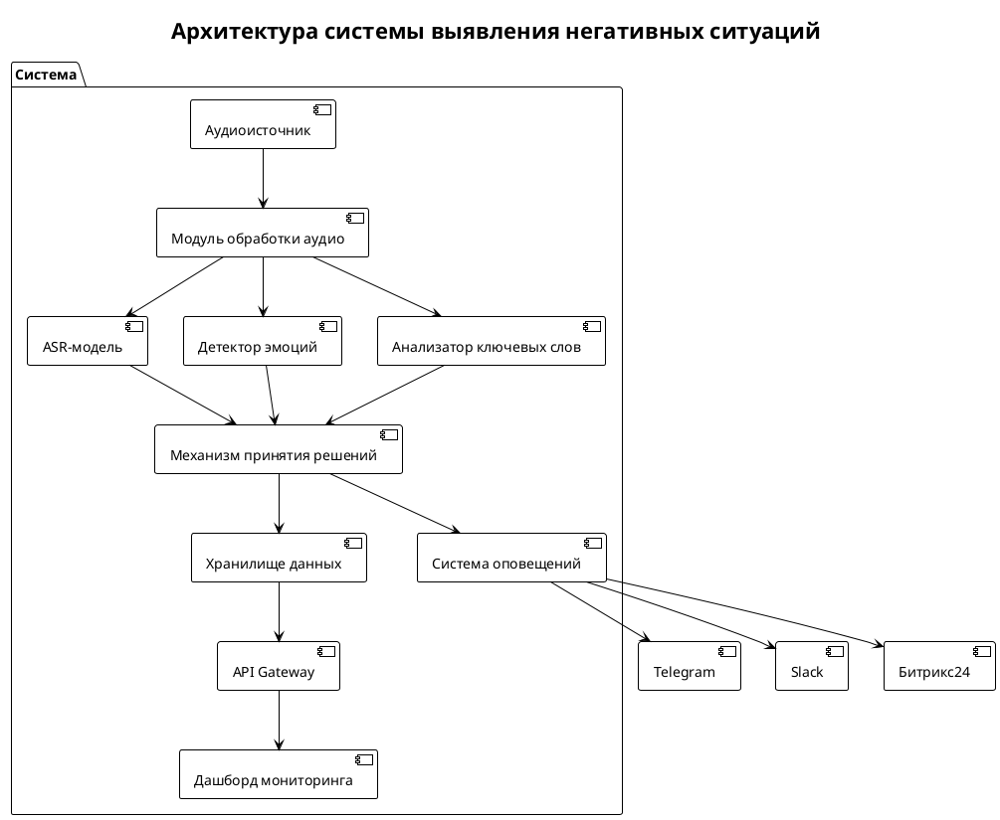
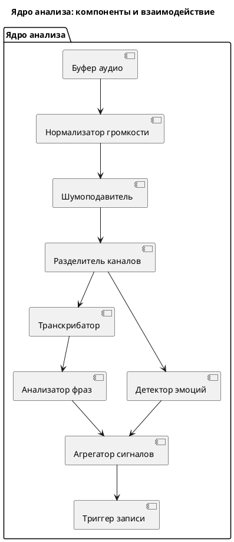
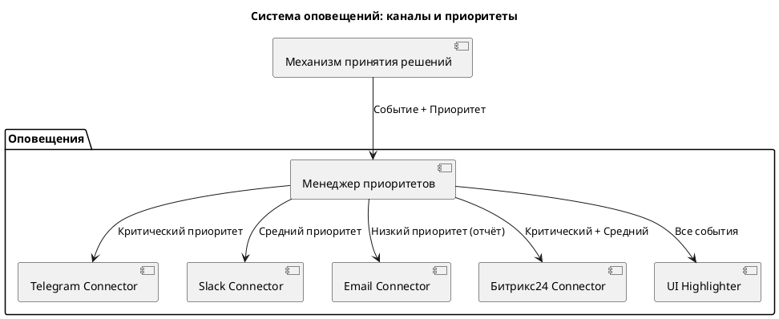
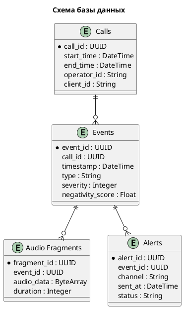
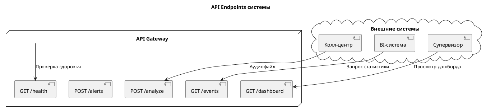
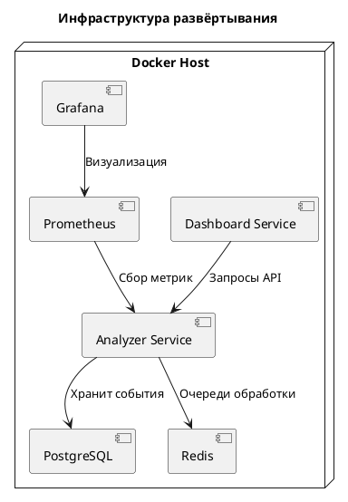
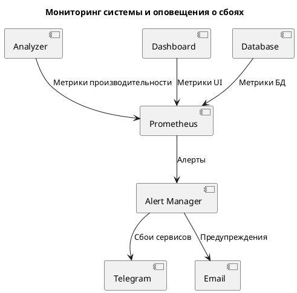
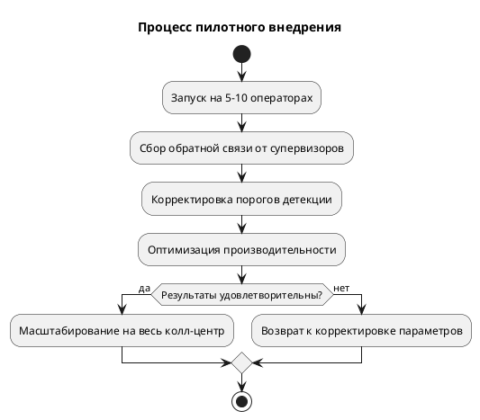
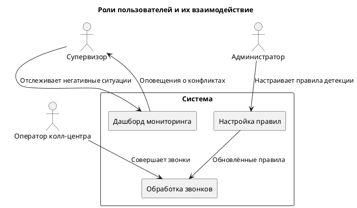

### Диаграммы в формате PlantUML

Диаграммы в формате PlantUML для описания системы выявления негативных ситуаций.

**Диаграмма 1. Общая архитектура системы**


**Диаграмма 2. Поток данных при обработке звонка**
```plantuml
@startuml
title Поток данных: обработка звонка и детекция негативных ситуаций

actor "Колл‑центр" as call_center
participant "Аудиопоток" as audio
participant "Предварительная обработка" as preprocess
participant "Транскрибация" as transcription
participant "Анализ эмоций" as emotion
participant "Поиск ключевых слов" as keywords
participant "Принятие решения" as decision
participant "Оповещение" as alert
participant "Дашборд" as dashboard

call_center -> audio: Аудиопоток звонка
audio -> preprocess: RAW аудио
preprocess -> transcription: Очищенный аудиосигнал
transcription -> emotion: Текст разговора
transcription -> keywords: Текст разговора
emotion -> decision: Уровень негатива (0–1)
keywords -> decision: Список триггеров
decision -> alert: Событие детекции
decision -> dashboard: Статистика
alert -> [Telegram]: Уведомление
alert -> [Slack]: Уведомление
@enduml
```

**Диаграмма 3. Компоненты ядра анализа**


**Диаграмма 4. Система оповещений**


**Диаграмма 5. Структура базы данных**


**Диаграмма 6. API Endpoints**


**Диаграмма 7. Развёртывание (Docker Compose)**


**Диаграмма 8. Мониторинг и оповещения о сбоях**


**Диаграмма 9. Процесс пилотного внедрения**


**Диаграмма 10. Взаимодействие пользователей с системой**
